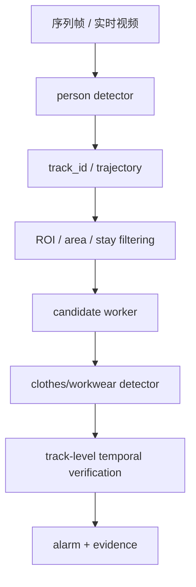

# `backend-train-model` 分阶段训练与完整链路搭建建议

本文档用于回答一个核心问题：

> 当前项目到底应该训练几个模型、先做哪些阶段、以及怎样在没有实时摄像头接入的前提下，把完整业务链路逐步搭起来。

本文档不是把当前代码现状写成“最终真理”，而是给出一条更贴合当前数据、当前业务目标与当前工程边界的推荐路线。

---

## 1. 先给结论

对于当前项目，不建议一开始就追求“一个模型直接学完整条业务链路”。

更稳妥、也更贴合你当前数据现实的路线是：

1. **先训练 `clothes/workwear` 检测模**
2. **再准备并训练 `person` 检测模型**
3. **把两者接入 `person -> crop -> clothes -> ROI -> 时序` 的完整链路**
4. **先做离线序列回放验证，再接实时摄像头**

也就是说，当前更推荐的是：

- **短期最小可用**：`1` 个模型
  - `clothes/workwear` 检测模型
- **中期推荐生产方案**：`2` 个模型 + `1` 层规则逻辑
  - `person` 检测模型
  - `clothes/workwear` 检测模型
  - `ROI / area / stay / temporal` 规则层
- **后期可选升级**：`2~3` 个模型 + 规则层
  - 在上述基础上，再按误报来源决定是否增加 `worker/customer` 分类模型或更细粒度 PPE 属性模型

当前阶段最不推荐的是：

- 直接把“工人识别、ROI 判断、时序告警、工服检测”都试图塞进一个端到端训练模型里

原因很简单：

- `ROI` 本质上是场景配置，不是稳定的视觉类别
- `时序告警` 本质上是跨帧决策，不是单帧检测标签
- 当前已有数据主要是 `clothes` 框，不是完整事件级标签
- 一个大一统模型即使训出来，也更难排查误报、漏报与链路失效位置

---

## 2. 真实生产目标与当前工程边界

### 2.1 真实生产目标

当前项目真正想解决的不是“图里有没有工服”这么简单，而是：

- 在加油站作业区里
- 针对疑似作业人员
- 稳定识别其是否穿着规定工服
- 并在满足时序条件时再触发告警

因此，真实生产目标更接近：

```text
person -> track_id -> ROI / area / stay filtering -> candidate worker -> workwear detection -> track-level temporal verification -> alarm
```

### 2.2 当前 `backend-train-model` 已经覆盖的部分

当前 `backend-train-model` 更适合负责下面这部分：

- 原始数据审计
- 训练集准备
- `clothes/workwear` 检测模型训练
- 评估与导出
- 在已有 `person` 模型时，为 `personcrop` 方案准备数据

也就是说，它现在天然更适合承担的是：

```text
数据准备 -> clothes 模型训练 -> 权重导出 -> 对接上游 person 链路
```

### 2.3 当前能力边界

当前阶段必须明确承认以下边界：

- 当前默认训练目标仍然是单类 `clothes`
- 当前代码里的 `auto` 模式，判断依据是“是否存在可用 `person` 模型权重”，不是“标注里是否出现了 `person` 类别”
- 当前训练脚本并不会把 `ROI`、`时序确认`、`告警策略` 训练成一个模型
- 没有实时摄像头时，仍然可以用**按时间顺序存放的图片序列**做离线链路验证

因此，“没有接摄像头”不是当前的最大限制；
真正的限制在于：

- 是否有连续序列数据
- 是否有可用 `person` 模型
- 是否有每个场景的 ROI / 阈值配置
- 是否有足够的误报 / 漏报样本支撑后续升级

---

## 3. 为什么当前不建议直接做“一个完整训练模型”

### 3.1 单模型并不能真正吞掉整条链路

即使你后续把标签扩成：

- `person`
- `clothes`

最多也只是把“人检测”和“工服检测”塞进一个检测器里。

它依然不能天然替代：

- 跟踪 `track_id`
- ROI 过滤
- 停留时长判断
- 跨帧时序确认
- 告警触发策略

### 3.2 单模型路线对当前数据并不友好

当前仓库里已经明确的、成体系的数据，核心还是 `clothes` 检测数据。

如果现在强行把任务改成“一个模型做完整业务输出”，通常会遇到下面几个问题：

- 训练标签定义会迅速膨胀
- 很多业务条件并不适合标成视觉框
- 数据量不够时，模型会把多个目标耦合得很混乱
- 线上问题出现后，很难判断是：
  - 人没检出来
  - 裁人失败
  - 工服没检出来
  - ROI 规则不合适
  - 时序阈值不合适

### 3.3 多阶段链路更利于持续升级

把链路拆开以后，每一层都可以独立升级：

- `person` 层不好，就补 `person` 数据
- `clothes` 层不好，就补工服框
- ROI 策略不好，就改场景配置
- 告警太抖，就调时序阈值

这比一上来做“大一统黑盒模型”更贴合你当前项目的工程现实。

---

## 4. 推荐的阶段划分

下面给出一条更适合当前项目的实际路线。

### 阶段 0：明确数据资产分层

这一阶段不急着改模型，而是先把数据资产分成几类。

建议至少分成以下几层：

1. **`clothes/workwear` 检测数据**
   - 当前你已经有这套数据
   - 目标是训练工服检测器
2. **`person` 检测数据**
   - 后续新增或补标
   - 目标是训练或微调上游人体检测器
3. **场景配置数据**
   - 每个摄像头对应的 ROI、面积阈值、停留阈值等
4. **链路验证样本**
   - 用于离线回放，验证完整链路是否真的贴合现场目标

#### 推荐做法

- **保留当前 `clothes` 标签体系不动**
- 新增 `person` 标签时，**优先使用独立标签目录或独立数据集**
- 不建议一开始就把 `person` 直接混入当前 `clothes` 主标签文件里

#### 为什么不建议一开始混标

因为当前 `backend-train-model` 的默认任务口径是单类 `clothes`。
如果你直接把同一份标签改成 `person + clothes` 多类混标，会同时牵动：

- 数据校验规则
- `dataset.yaml` 的类别定义
- `single_cls` 行为
- 评估口径
- 与 `inspection-flask` 的 `clothes-only` 复核假设

这会让“补 `person` 数据”这件本来应该是增量收益的事，变成一次任务定义重构。

---

### 阶段 1：先把 `clothes` 模型训稳

这是当前最值得先完成的阶段。

#### 目标

- 先得到一个稳定、可复现的 `clothes/workwear` 检测基线模型
- 明确当前误报 / 漏报主要来自哪里
- 为后续 `personcrop` 对比提供 baseline

#### 推荐模式

- **优先使用 `fullframe` 作为 baseline**

原因：

- 当前 `fullframe` 依赖最少
- 不要求你先有 `person` 权重
- 更适合作为最初的可比基线

#### 阶段产物

- `best.pt`
- `*_train.json`
- `*_evaluate.json`
- 失败案例清单

#### 阶段通过标准

至少要能回答下面几个问题：

- 小目标工服是否能检出
- 背身、遮挡、低光下是否明显掉点
- 哪些画面容易把顾客 / 背景误识别成工服目标
- 当前模型对现场常见姿态是否足够稳定

---

### 阶段 2：补 `person` 数据，并训练 / 固化 `person` 模型

这是整条链路从“工服检测基线”走向“完整业务链路”的关键阶段。

#### 这一阶段应该补什么

建议补的是：

- **整个人框 `person` 标签**

而不是一上来去补：

- “工人身份”
- “候选作业人员”
- “违规事件”

因为这些概念目前更适合由规则与链路逻辑来定义，不适合直接作为第一步监督信号。

#### `person` 数据怎么组织更合理

推荐以下任一组织方式：

##### 方案 A：同图双标，但标签目录分离

同一批图片同时拥有：

- 一套 `clothes` 标签
- 一套 `person` 标签

但二者不要放在同一个训练标签目录里。

##### 方案 B：独立 `person` 数据集

单独准备一套 `person` 检测训练数据；
其中可以包含你当前加油站场景，也可以混入通用行人数据，再做场景微调。

#### 阶段产物

- `person_detect_yolov8.pt` 或同类人体检测权重

#### 这一阶段完成后能带来什么

一旦你有了可用的 `person` 权重：

- `backend-train-model` 的 `auto` 模式才会真正具备切到 `personcrop` 的条件
- 上游链路才能稳定地做“先找人，再裁人，再看工服”

#### 关键提醒

**只有 `person` 标签，还不够。**

`auto` 模式需要的是：

- **可用的 `person` 模型权重**

而不是：

- 标注文件里存在 `person` 类别

所以，正确顺序是：

```text
补 person 标签 -> 训练 / 微调 person 模型 -> 产出 person 权重 -> 再让 auto/personcrop 生效
```

---

### 阶段 3：在 `personcrop` 方案上重训 `clothes` 模型

当 `person` 模型准备好以后，推荐进入这一阶段。

#### 目标

- 让工服检测尽量聚焦在人体局部区域
- 减少大背景、车辆、地面、油机等无关区域干扰
- 让训练口径更贴近未来真实业务链路

#### 推荐做法

使用当前工具链的：

- `--mode auto` 或
- `--mode personcrop --person-model ...`

并保留一次和 `fullframe` 的对比实验。

#### 为什么这一步值得做

如果上游 `person` 检测足够稳，`personcrop` 往往有几个优势：

- 画面主体更集中
- 小目标工服特征更容易被模型关注
- 更接近真实在线推理顺序

#### 但要注意的风险

`personcrop` 也会引入新的误差来源：

- `person` 漏检会直接导致后续 `clothes` 丢失
- 人框过小、过偏，会影响裁剪质量
- `clothes` 框分配给哪个人，依赖 IOA 阈值与人物检测质量

所以推荐做法不是“直接替代 `fullframe`”，而是：

- 让 `fullframe` 成为稳定 baseline
- 再用 `personcrop` 做第二套更贴近业务链路的模型
- 最后按验证结果决定部署主方案

---

### 阶段 4：离线搭建完整链路，不必等实时摄像头

这是一个非常关键的认识：

> 没有实时摄像头，不等于不能搭建完整链路。

如果你已经有按时间顺序组织的序列图片，就可以做离线链路回放。

#### 这一阶段的目标

在离线条件下尽量复现未来线上流程：

```text
序列帧输入
-> person 检测
-> track_id / 简化轨迹关联
-> ROI / area / stay filtering
-> candidate worker
-> clothes 检测
-> track-level temporal verification
-> 告警输出
```

#### 这一阶段需要哪些输入

至少需要：

- 序列图片
- `person` 权重
- `clothes` 权重
- 每个摄像头对应的 ROI 配置
- 基础阈值配置
- 一批可用于验证的正负案例

#### 这一阶段最重要的不是训练，而是链路评估

需要重点看：

- 顾客经过时会不会被误触发
- 作业区边缘目标是否频繁抖入 / 抖出
- 站在车边、弯腰、半遮挡时会不会持续误判
- 工服偶发漏检是否会被时序层放大成误报

#### 这一阶段的产物

- 每个摄像头的 ROI 配置
- 关键阈值建议
- 误报样本库
- 漏报样本库
- 链路级回放报告

---

### 阶段 5：接入实时摄像头与线上灰度

只有在前面的离线链路已经基本稳定后，再建议进入这一阶段。

#### 这一阶段的目标

- 将离线验证过的链路接到实时视频流
- 做每路摄像头的场景阈值微调
- 明确线上误报 / 漏报来源

#### 这一阶段更像工程部署，不是单纯训练问题

主要工作一般会集中在：

- 摄像头取流稳定性
- ROI 画法
- 目标框抖动处理
- 时序窗口设置
- 证据图保存
- 告警频控

---

## 5. 当前推荐训练几类模型

### 5.1 当前最推荐：两类模型，分阶段完成

对于你当前项目，我最推荐的组合是：

#### 必需模型 1：`person` 检测模型

用途：

- 找人
- 裁人
- 提供上游候选区域

#### 必需模型 2：`clothes/workwear` 检测模型

用途：

- 判断人体区域内是否检出工服相关目标

#### 非模型层：规则 / 时序层

包括：

- ROI
- 面积过滤
- 停留时长
- 连续多帧确认
- 告警抑制

这部分当前更适合继续保留为规则层，而不是强行训练成一个模型。

---

### 5.2 当前不建议直接训练的“第三类模型”

以下类型不是当前第一优先级：

- `worker/customer` 分类模型
- “违规事件直接分类器”
- 把 `ROI`、时序与工服状态揉成一个事件模型

不是说它们永远没价值，而是：

- 当前数据未必足够
- 当前误报主因未必已经定位清楚
- 现在就上第三模型，往往会把问题复杂化

---

### 5.3 后续什么时候考虑第三模型

只有在下面这些条件同时出现时，再考虑新增第三模型更合适：

- `person` 已比较稳定
- `clothes` 已比较稳定
- ROI / 时序阈值已经调过一轮
- 误报仍然主要来自“顾客 / 非作业人员混入”
- 你已经能拿到足够多、定义清楚的 `worker / customer` 或候选作业人员样本

这时再考虑：

- `worker/customer` 分类模型
- 或者更细粒度的 PPE 属性模型

会更有性价比。

---

## 6. 关于“是否要加 `person` 标签”的明确建议

### 6.1 结论

**建议加。**

但建议的方式是：

- **作为独立的人体检测数据资产来补**

而不是：

- 直接把当前 `clothes` 主训练标签整体改成多类混标方案

### 6.2 为什么建议加

加 `person` 标签的价值主要在于：

- 让你拥有自己的上游 `person` 模型
- 让 `personcrop` 真正可控
- 让离线完整链路验证更贴近现场
- 减少对外部通用人体模型的依赖

### 6.3 只加标签还不够

必须再次强调：

```text
有 person 标签 ≠ auto 一定会生效
```

真正让 `auto` 生效的条件是：

```text
存在可用的 person 模型权重
```

所以正确的落地顺序是：

1. 补 `person` 标签
2. 训练 / 微调 `person` 模型
3. 导出 `person` 权重
4. 把权重放到约定位置或通过 `--person-model` 显式传入
5. 再使用 `auto` 或 `personcrop`

---

## 7. 推荐的完整链路形态

当前更推荐的完整链路，不是“一个大模型”，而是下面这种分层形态：



这条链路的优点是：

- 每层职责清晰
- 问题容易定位
- 便于单独补数据
- 便于逐步上线
- 便于未来替换某一层，而不是推倒重来

---

## 8. 当前仓库最推荐的落地顺序

如果只考虑你现在这个仓库，推荐按下面的顺序推进：

### 第一步：继续保持当前 `clothes` 任务为主线

- 不急着把当前标签体系改成多类混标
- 先把 `clothes` 检测基线训出来

### 第二步：建立 `person` 数据资产

- 单独补 `person` 标签
- 单独训练或微调人体检测模型

### 第三步：把 `person` 权重接回 `backend-train-model`

推荐目标状态：

- `backend-train-model/weights/person_detect_yolov8.pt`

达到这个状态后：

- `auto` 模式才真正有机会默认走到 `personcrop`

### 第四步：对比 `fullframe clothes` 与 `personcrop clothes`

不要直接拍脑袋决定哪个更好，而是做验证集对比：

- 谁在现场误报更低
- 谁对遮挡更稳
- 谁对远距离小目标更敏感

### 第五步：先做离线链路回放，再接实时流

这是最重要的一步工程纪律：

- 先用序列帧把完整链路跑通
- 再接实时 RTSP / 摄像头

不要在“链路还没离线站稳”的时候就直接上线追实时告警。

---

## 9. 升级触发条件

当出现下面情况时，才建议推进下一层升级：

### 9.1 触发从阶段 1 升到阶段 2

- 当前 `clothes` baseline 已经可复现
- 误报 / 漏报分析表明需要更稳定的人体上游

### 9.2 触发从阶段 2 升到阶段 3

- 已经有可用的 `person` 权重
- `person` 在你的现场画面上表现基本可接受

### 9.3 触发从阶段 3 升到阶段 4

- `personcrop` 版 `clothes` 模型已完成训练
- 你已经具备序列级离线回放条件

### 9.4 触发从阶段 4 升到阶段 5

- 离线完整链路已跑通
- 已经拿到场景 ROI 与关键阈值
- 离线误报水平在可接受范围内

---

## 10. 最终建议

如果只用一句话总结当前最推荐的路线，那就是：

> **先把 `clothes` 模型训稳，再补 `person` 模型，随后用两模型加规则层搭建完整链路；在没有实时摄像头的情况下，先通过离线序列回放完成完整链路验证，而不是一开始就追求一个吃掉所有业务逻辑的大模型。**

这条路线的好处是：

- 更贴合你现在已有数据
- 更贴合当前仓库代码边界
- 更容易逐步迭代
- 更容易解释为什么报错、为什么漏报
- 更容易从“可训练”走到“可上线”
