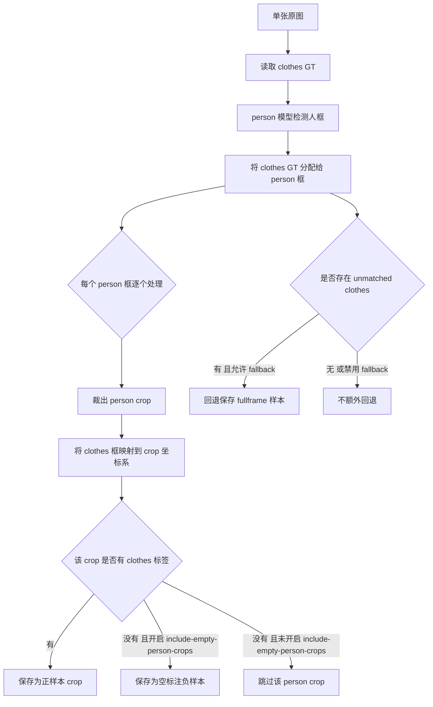

# `backend-train-model` 运行逻辑说明

本文档用于说明当前 `backend-train-model` 的**训练逻辑、数据准备逻辑、模型选择逻辑**，并补一张便于快速理解的流程图。

---

## 1. 当前项目训练的到底是什么

当前 `backend-train-model` 训练出来的模型，本质上是一个 **YOLOv8 单类 `clothes` 检测模型**，不是直接输出“未穿工服”的规则模型。

这几点很关键：

- 当前数据集类别只有 1 类：`0 -> clothes`
- 训练阶段只学习“哪里有 `clothes` 框”
- **ROI、时序稳定、告警触发** 不属于当前模型训练的一部分
- 如果后续接真实摄像头，仍然需要叠加：
  - `person` 检测
  - `ROI` 约束
  - 时序稳定判定
  - 告警规则

因此，当前更准确的说法是：

> 先训练一个 `clothes` 检测模型，后续再把它放到“`person -> 裁人 -> clothes -> ROI -> 时序`”的业务链路里使用。

---

## 2. `train` 命令的总体逻辑

### 2.1 整体概览

当你执行下面这条命令时：

```powershell
D:\Miniconda3_python\envs\yolo_code\python.exe backend-train-model\train_workwear.py train
```

脚本做的事情不是“直接开始训练”，而是会按下面的顺序执行：

1. 解析最终要使用的 `dataset.yaml`
2. 如果没有现成的 prepared 数据集，就先做 `audit + prepare`
3. 再解析训练起点模型：
   - 默认优先 `yolov8n.pt`
   - `--from-scratch` 时改用 `yolov8n.yaml`
4. 调用 Ultralytics 的 `YOLO(...).train(...)`
5. 读取本次 run 的 `best.pt / last.pt`
6. 写入训练报告 `*_train.json`

---

## 3. `train` 主流程图

```mermaid
flowchart TD
    A[执行 train 命令] --> B{是否显式传入 --dataset-yaml}
    B -- 是 --> C[直接使用该 dataset.yaml]
    B -- 否 --> D{默认 prepared 目录里是否已有 dataset.yaml}
    D -- 是 --> C
    D -- 否 --> E[先执行 audit_dataset 审计原始数据]
    E --> F{resolve prepare mode}
    F -- auto 且无 person 模型 --> G[prepare: fullframe]
    F -- auto 且有 person 模型 --> H[prepare: personcrop]
    F -- 显式 fullframe --> G
    F -- 显式 personcrop --> H
    G --> C
    H --> C

    C --> I{训练起点模型怎么选}
    I -- 默认 --> J[优先使用本地 weights/yolov8n.pt 微调]
    I -- --from-scratch --> K[使用本地 model_defs/yolov8n.yaml]
    I -- --base-model --> L[使用用户指定的 .pt 或 .yaml]

    K --> M{是否传 --init-weights}
    M -- 是 --> N[加载兼容的 .pt 初始化权重]
    M -- 否 --> O[随机初始化]

    J --> P[创建 YOLO(model_spec)]
    L --> P
    N --> P
    O --> P

    P --> Q[调用 model.train]
    Q --> R[读取本次 run_dir 下的 best.pt / last.pt]
    R --> S[写入 *_train.json 训练报告]
```

---

## 4. 数据集准备逻辑

### 4.1 先做 `audit`

训练前，脚本会先审计原始数据，主要检查：

- 图片目录和标签目录是否存在
- 图片与标签是否能按同名 `stem` 一一对应
- 不同序列之间是否出现重名图片
- 标签文件是否满足当前项目约定：
  - 只有 5 个字段
  - 格式是 `class_id x_center y_center width height`
  - 坐标归一化到 `[0, 1]`
  - 当前类别只能是 `0`

也就是说，如果数据本身不干净，脚本会在训练前直接报错，而不是“带病训练”。

---

### 4.2 默认切分策略

当前切分比例是：

- `train: 0.70`
- `val: 0.15`
- `test: 0.15`

默认切分策略是：

- `sequence_contiguous`

它的含义是：

- 每个原始序列内部，按连续区间切成 `train / val / test`
- 这样做的目的是：
  - 当前原始序列数量比较少
  - 如果直接按整序列隔离，训练集可能会过小

如果后面你拿到更多独立序列，可以再考虑改成：

- `sequence_holdout`

它会按完整序列分给 `train / val / test`，更严格，但对数据量要求更高。

---

## 5. `prepare` 的两种模式

### 5.1 `fullframe`

这是最直接、最朴素的准备方式：

- 直接复制原图到 `images/{split}`
- 读取并重写标签到 `labels/{split}`
- 不做人裁剪
- 不做框重新分配

这个模式的特点是：

- 简单
- 稳定
- 不依赖 `person` 模型
- 更适合作为 baseline

如果你不传 `--person-model`，在当前配置下默认就会走它。

---

### 5.2 `personcrop`

这是更接近你原始业务思路的模式。

处理流程如下：

1. 先用 `person` 检测模型找出图片里的 `person` 框
2. 再把原始 `clothes` 标注框分配给最合适的人框
3. 对每一个人框裁出局部图
4. 把 `clothes` 框映射到 crop 的局部坐标系
5. 生成新的裁剪图和对应标签

它的优点是：

- 更贴近真实业务链路
- 背景干扰更少
- 更容易聚焦到“人身上的衣服”

它的代价是：

- 依赖 `person` 检测模型
- 一旦 `person` 漏检，后面的 `clothes` 就全漏

---

## 6. `personcrop` 分支流程图



---

## 7. `personcrop` 当前默认行为

这一部分非常重要，因为它决定了当前逻辑更偏“正样本裁剪”还是“正负样本都保留”。

### 7.1 默认不保留空人物裁剪

当前默认配置：

- `DEFAULT_INCLUDE_EMPTY_PERSON_CROPS = False`

含义是：

- 如果一个 `person` 框里**没有分到任何 `clothes` 框**
- 默认**不会**把这个人物裁剪图保存成空标注负样本

如果你希望模型更多看到“人框里没有 clothes”的情况，可以显式加：

```powershell
--include-empty-person-crops
```

---

### 7.2 默认允许 unmatched clothes 回退为 fullframe

当前默认配置：

- `DEFAULT_FALLBACK_TO_FULLFRAME = True`

含义是：

- 如果某些 `clothes` 框找不到匹配的人框
- 脚本会把它作为一个 `fullframe` 样本回退保留下来

这样做的目的是尽量减少 GT 被误丢弃。

如果你想严格禁止这类回退，可以显式加：

```powershell
--no-fallback-to-fullframe
```

---

## 8. 训练起点模型的选择逻辑

### 8.1 默认推荐：`yolov8n.pt`

当前默认训练起点是：

- `backend-train-model/weights/yolov8n.pt`

设计意图是：

- 样本量不算特别大时
- 用带预训练权重的 `.pt` 做微调，通常比从零开始更稳定

因此，默认训练逻辑是：

- **优先微调 `yolov8n.pt`**

---

### 8.2 从零训练：`yolov8n.yaml`

如果你显式传：

```powershell
--from-scratch
```

脚本就会改成使用：

- `backend-train-model/model_defs/yolov8n.yaml`

这时表示：

- 只用模型结构
- 权重从随机初始化开始

---

### 8.3 `.yaml + --init-weights`

还支持一种中间形式：

- 先用 `.yaml` 建模型结构
- 再通过 `--init-weights` 加载一个兼容的 `.pt` 当初始化权重

这种方式适合：

- 你想保留结构可改性
- 但又不想完全随机初始化

注意：

- `--init-weights` **只能**配合 `.yaml/.yml` 使用
- `--from-scratch` **不能**和 `--init-weights` 同时使用

---

### 8.4 不会自动“训练生成一个 `yolov8n.pt`”

如果你不放本地 `yolov8n.pt`：

- 脚本**不会自己训练出一个 `yolov8n.pt`**
- 默认会直接报错

只有在你显式加了：

```powershell
--allow-remote-model-download
```

时，才允许 Ultralytics 自动下载默认模型。

也就是说：

- **不放本地 `.pt` ≠ 自动生成 `.pt`**
- **不放本地 `.pt` + 允许远程下载 = 自动下载官方默认模型**

---

## 9. 真正调用 Ultralytics 训练时做了什么

当 `dataset.yaml` 和 `model_spec` 都准备好后，脚本会：

1. 创建 `YOLO(model_spec)`
2. 如果传了 `--init-weights`，就再执行一次 `.load(init_weights)`
3. 调用 `model.train(...)`

当前训练参数的核心特点如下：

- `single_cls=True`
  - 当前只训练单类 `clothes`
- `imgsz=640`
- `epochs=180`
- `batch=4`
- `patience=40`
- `workers=0`
- `device=cpu`
- `seed=42`
- `deterministic=True`

因此现在的训练，本质上是：

> 在准备好的 `fullframe` 或 `personcrop` 数据集上，训练一个单类 `clothes` 检测器。

---

## 10. 训练结束后输出什么

训练完成后，脚本会读取本次运行目录下的：

- `best.pt`
- `last.pt`

并把以下信息写入训练报告：

- 实际使用的数据集 `dataset.yaml`
- 训练起点模型来源
- 是否允许远程下载
- 是否 `from_scratch`
- `run_dir`
- `best_weight`
- `last_weight`
- 各项训练参数

注意：

- 训练产物是 `best.pt / last.pt`
- 不是重新“生成一个 `yolov8n.pt`”

---

## 11. 默认执行 `train` 时，当前实际行为

如果你什么都不额外传，只执行：

```powershell
D:\Miniconda3_python\envs\yolo_code\python.exe backend-train-model\train_workwear.py train
```

那么在当前仓库配置下，它的默认行为可以概括为：

1. 审计原始数据
2. 自动 prepare 数据集
3. 因为默认没有可用的 `person` 模型候选，所以 prepare 实际会走 `fullframe`
4. 默认优先使用本地 `backend-train-model/weights/yolov8n.pt`
5. 训练一个单类 `clothes` 检测模型
6. 输出 `best.pt`

也就是说，**当前默认并不是“先裁人再训练”**，而是：

> **默认 `fullframe` + 默认 `yolov8n.pt` 微调**

如果你想改成更接近原始业务思路的方式，需要显式传入 `--person-model`，把 prepare 切到 `personcrop`。

---

## 12. 推荐理解方式

可以把当前项目理解成两层：

### 第一层：模型训练层

这里只负责训练一个：

- `clothes` 检测模型

它不直接负责：

- ROI 业务约束
- 时序稳定
- 违规告警表达

### 第二层：业务推理层

未来接真实摄像头时，更完整的链路应是：

```text
person 检测 -> 裁人 -> clothes/workwear 检测 -> ROI 过滤 -> 时序稳定 -> 告警
```

这也是你原本“`person + clothes + ROI + 时序`”的思路。

---

## 13. 典型命令示例

### 13.1 默认训练

```powershell
D:\Miniconda3_python\envs\yolo_code\python.exe backend-train-model\train_workwear.py train
```

---

### 13.2 使用 `personcrop`

```powershell
D:\Miniconda3_python\envs\yolo_code\python.exe backend-train-model\train_workwear.py train --mode personcrop --person-model your_person_model.pt
```

---

### 13.3 使用 `personcrop`，并保留空人物裁剪负样本

```powershell
D:\Miniconda3_python\envs\yolo_code\python.exe backend-train-model\train_workwear.py train --mode personcrop --person-model your_person_model.pt --include-empty-person-crops
```

---

### 13.4 从零训练

```powershell
D:\Miniconda3_python\envs\yolo_code\python.exe backend-train-model\train_workwear.py train --from-scratch
```

---

### 13.5 允许自动下载默认模型

```powershell
D:\Miniconda3_python\envs\yolo_code\python.exe backend-train-model\train_workwear.py train --allow-remote-model-download
```

---

## 14. 一句话总结

当前 `backend-train-model` 的默认训练逻辑可以总结成：

> **先审计并准备数据，再用 `yolov8n.pt` 微调，训练一个单类 `clothes` 检测模型；如果要走你原来的思路，就显式切到 `personcrop`，后续上线时再叠加 ROI 和时序规则。**
