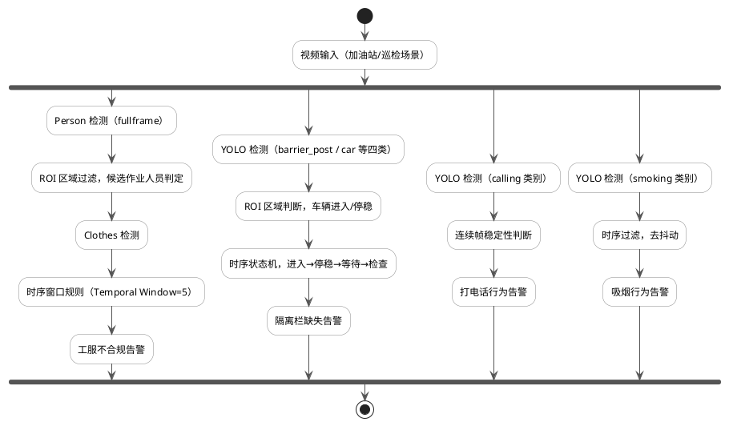
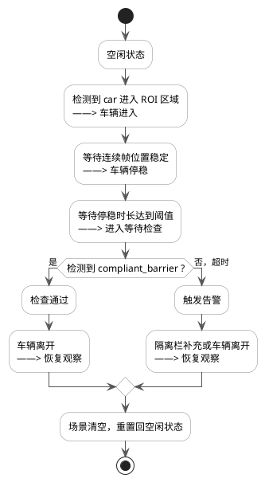
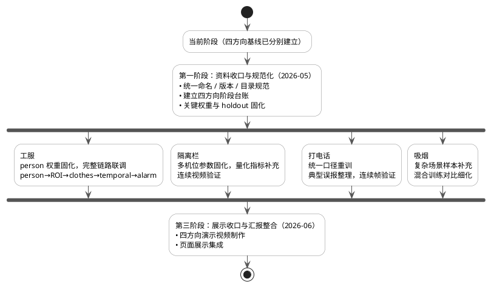
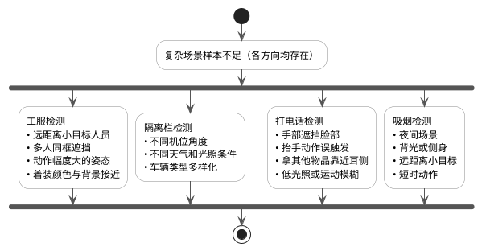
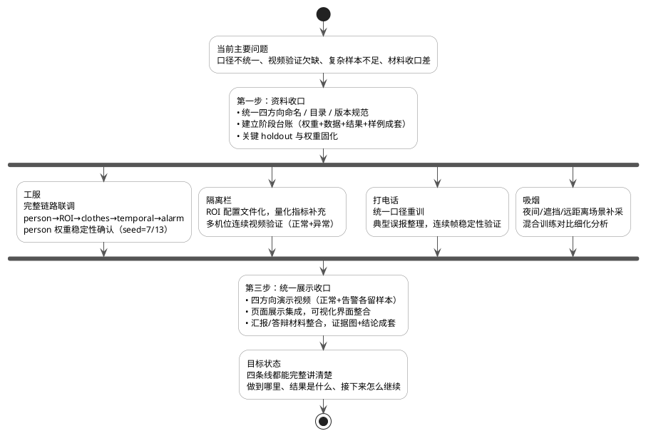

# 中期汇报

## 零、项目进展小结

本项目面向加油站/巡检场景，目标是通过视频监控自动识别多类安全风险，减少依赖人工巡检带来的响应延迟和盲区问题。项目立项以来，四条检测任务——工服检测、隔离栏缺失检测、打电话行为检测和吸烟检测——始终是同步推进的，并不是某一条做完再去推进另一条，而是根据各自任务的技术难度和数据获取情况，分别进入不同的推进阶段。

截至目前，项目整体进展可以从以下几个维度来描述。

**数据工程层面**，工服检测方向的数据建设最为系统，完成了多源数据的整合、人工复核、balanced 采样处理、按序列切分以及固定 holdout 测试集的构建，形成了一套可以跨版本公平比较的评估体系。person 检测数据集也已完整准备，共 `502` 张图、`1658` 个标注框，按 `sequence_contiguous` 策略完成了 train/val/test 三段划分。隔离栏、打电话和吸烟方向都完成了数据集的基本整理，其中吸烟方向还尝试了将公共数据集与现场采集数据混合训练，并得到了可量化的对比结论。

**模型训练层面**，四条任务都完成了至少一个版本的完整训练周期，部分方向做了多个版本的系统对比。工服检测经过多轮迭代，完成了 first-train 与 merged 多源策略的公平对照，固定了当前 baseline 权重；person 检测方向系统性地比较了 fullframe 和多个 ROI-aware 版本，完成了边界截断问题的复盘分析和修复，并通过逐帧 FP/FN 分析定位了主要漏检来源。打电话检测完成了四个模型规格（`YOLOv8s`、`YOLO11n`、`YOLO11s`、`YOLO11m`）的横向对比，每组都保留了完整的训练记录。吸烟检测完成了公共数据与混合数据两种训练方案的对比，验证了现场数据的正向贡献。

**系统工程层面**，隔离栏缺失检测已经推进到视频级原型阶段，构建了一套"YOLO 检测器 + ROI 区域过滤 + 时序状态机"的完整告警流程，能够在实拍视频上演示从车辆进入到告警触发的全流程。工服检测的在线链路框架也已初步实现，涵盖 person 检测、ROI 过滤、workwear 检测、SimpleIoU 跟踪器和时序窗口规则几个核心模块，各关键阈值和规则参数均已配置。

**当前主要欠缺**集中在以下几点：四条任务的整理方式和评估口径还不完全统一，完整告警链路尚未端到端跑通过真实视频，复杂场景（夜间、遮挡、远距离、多人同框等）的样本覆盖仍然不足，汇报所需的展示材料也还没有系统地整合成套。这些问题不是方向性的错误，而是项目从探索阶段走向工程化阶段时普遍面临的"结果已有、收口还差一步"的问题，是下一阶段的主要工作重心。

总体来看，项目当前处于"基础能力已具备、各方向进入深化验证阶段"的节点。四条任务的技术路线已经验证可行，训练和评估体系已经初步建立，下一阶段需要重点推进的是链路联调、视频验证和材料收口，让已有的技术成果转化为可以完整展示、清晰说明的项目成果。

---

## 一、阶段成果

截至 `2026-04-21`，我参与的这个项目已经形成了一个面向加油站/巡检场景的多风险视频智能检测系统，目前由四条检测任务共同组成：工服检测、隔离栏缺失检测、打电话行为检测和吸烟检测。这四条任务针对同一批监控视频、同一套巡检场景展开，目标是从多个维度感知作业区内的安全风险。当前四条任务各自都完成了阶段性的数据准备、模型训练和验证工作，在数据工程积累的深度上有所不同。

从技术路线上看，四条任务都基于 YOLO 系列目标检测模型，在单帧检测的基础上各自引入了适配业务场景的后处理逻辑：工服检测引入了多级检测链路和时序窗口规则，隔离栏检测引入了时序状态机，打电话检测引入了连续帧稳定性判断，吸烟检测引入了时序过滤去抖动。这种共用底层技术、各自针对业务场景扩展的设计思路，使得四条任务在工程实现上有较强的互补性和可迁移性。

下图是整个项目的检测架构，展示了视频输入如何分流到四条检测任务，以及每条任务各自的检测逻辑和告警输出：

---

### 1.1 工服检测

工服检测的最终目标不是简单判断画面里有没有工服，而是判断"ROI 作业区内的人有没有穿工服"。这两个描述看起来相近，但在实现上差别很大：前者只需要一个检测模型扫全帧就行，后者必须先定位人员、再结合 ROI（感兴趣区域，即划定的作业范围）判断这个人是否属于作业区内的候选工作人员，最后再对这部分人做工服识别，还要通过时序规则减少因遮挡、运动模糊等造成的单帧误判抖动。这个目标设定决定了整条链路需要三个模块协同工作：`person` 检测、ROI 过滤和 `clothes` 检测，配合时序窗口规则（Temporal Window=5，Trigger Ratio=0.6）来控制告警抖动。

#### 数据工程

`clothes` 方向整合了多个来源的标注数据，这些数据来自不同批次的现场视频采集，涵盖了不同摄像头角度、不同光照时段和不同人员体型的场景，整合的目的是让模型在训练时见过足够多样化的工服外观，而不会对单一拍摄角度过拟合。经过数据清洗和人工复核之后，用 `trainval_balanced_v1.split.csv` 构建训练集和验证集，用单独的 `unified_holdout_v1.split.csv` 构建统一 holdout 测试集。holdout 集共包含 `75` 张图、`150` 个 GT 框，固定后不再参与任何训练，只在最终版本选型时使用，保证不同版本模型之间的比较有公平基准。这样做的原因是：如果每次都用相同数据既训练又评估，或者不同版本的模型用了不一样的测试集，得出的结论就没法横向比较，容易形成"每一版都说自己比上一版好"的误判。在早期实验里，正是发现了这个问题之后，才专门建立了这套固定 holdout 评估体系。

在合并多源数据时，还做了 balanced 采样处理。这是因为不同来源的视频在帧率和拍摄时长上有差异，直接合并会导致某几个数据源的样本占比过高，模型容易对那些数据源的拍摄风格过拟合。balanced 策略通过对各数据源按一定比例采样，缓解了这个不均衡问题，从实验结果来看，balanced 版本在统一 holdout 上的表现也确实优于直接合并的版本。

`person` 方向共准备了 `502` 张图、`1658` 个 person 框，其中 `8` 张图无人员标注，作为负样本保留。数据按 `sequence_contiguous` 策略（按视频序列顺序连续切分，避免相邻帧同时出现在训练集和测试集中，防止数据泄露）划分，训练集 `350` 张图、`1258` 个框，验证集 `77` 张图、`219` 个框，测试集 `75` 张图、`181` 个框。采用 `sequence_contiguous` 而非随机切分的原因是：监控视频的相邻帧之间内容高度相似，如果随机切分，相邻帧很可能同时出现在训练集和测试集里，使得测试集指标虚高，不能真实反映模型在新场景下的泛化能力。

#### `clothes` 模型训练结果

经过多轮实验和统一 holdout 的公平对照，最终选定 `clothes_merged_v2_balanced_from_first_holdout_v1` 作为当前暂定 baseline，该模型在合并多源数据并做 balanced 采样策略后训练得到。在选定这个版本之前，共对比了 `first-train`（仅第一批数据训练）、`clothes_merged_v1`（合并未做 balanced 处理）、`clothes_merged_v2_from_first`（合并后从第一版初始化）等多个候选版本，最终确认 balanced 合并策略在统一 holdout 上的表现最为稳定，因此将其固定为当前 baseline 并不再频繁切换。

在统一 holdout 测试集上，以 `conf=0.45`、NMS IoU `0.7`、GT 匹配 IoU `0.5` 为评估口径，Precision（精确率）达到 `0.9797`，Recall（召回率）达到 `0.9653`，mAP50（IoU=0.5 下均值平均精度）达到 `0.9875`，mAP50-95（IoU 从 0.5 到 0.95 的综合均值精度）达到 `0.8042`。逐图复盘结果是 TP=144、FP=3、FN=6，在 `75` 张测试图、`150` 个 GT 框上仅漏 6 个框、误报 3 个框，表现相当稳健。值得注意的是，mAP50 和 mAP50-95 之间存在约 `0.18` 的差距，说明模型对工服的分类能力已经很强，但在更严格的定位精度要求（高 IoU）下还有提升空间，这主要体现在部分框的边界对齐精度上，对于工服告警这个业务场景来说，这个差距的实际影响相对有限。

**训练过程曲线（`clothes_merged_v2_balanced_from_first_holdout_v1`）**

**归一化混淆矩阵（测试集）**

从混淆矩阵可以看出，`clothes` 类别的检测准确率很高，将背景误报为工服的情况极少，漏检主要集中在少数远距离或被严重遮挡的场景。

**PR 曲线**

PR 曲线整体靠近右上角，说明模型在较宽泛的阈值范围内都能保持较高的 Precision 和 Recall。当前在线链路选用 `conf=0.45`，在测试集上 FP 仅有 3 个，说明这个阈值选择是合理的。

#### Person 检测（ROI-aware）

`person` 检测的目标是在 ROI 作业区内准确定位人员，从而支撑后续的工服合规判断。在实验过程中，发现早期 ROI 裁剪策略在边界处理上不够严谨，大量与 ROI 边界存在交叉的人员框因交叉率低于 `min_box_ioa=0.25` 阈值而被过滤，导致第一版 `roi_aware_baseline` 的 Recall 反而低于 `fullframe_baseline`（`0.5950` vs `0.6740`）。针对这个问题，在 v3 版本中引入了 `crop_margin_px=64` 的边界扩展参数，让裁剪区域比 ROI 边界多留 64 像素缓冲。经复盘统计，原本 `54` 个在边界处会被截断的 keep-positive 框，加上 `margin64` 后挽回了 `31` 个，剩余 `23` 个是贴紧原图边界的极端情况，影响可以忽略。

当前主线 `person_roi_aware_v3_mask_then_crop_margin64_from_fullframe` 以 `fullframe_baseline` 权重作为初始化，采用 `mask_then_crop` 模式（先用 ROI 之外的区域做 mask 遮盖，再裁剪到 ROI 范围），加上 `crop_margin_px=64` 边界扩展。以 `fullframe_baseline` 权重初始化而不是从零开始训练，是因为 ROI 裁剪后的数据集只有 `502` 张图，数据量相对较少，直接从零训练容易欠拟合，而利用在全帧数据上预热过的权重作为起点，能加速收敛并减少小数据集带来的不稳定性。测试集上 Precision 为 `0.9208`，Recall 提升到 `0.7075`，mAP50 达到 `0.7779`，mAP50-95 达到 `0.4607`，相比 fullframe 基线在 Recall 和 mAP 上均有明显提升。也尝试了输入尺寸从 `640` 扩大到 `768` 的变体，Precision 提高到 `0.9663`，但 Recall 降到 `0.6435`，mAP50 降到 `0.7535`，综合表现不如当前主线，说明在当前数据规模下单纯放大输入分辨率并不能带来整体性能提升，可能的原因是更大的输入尺寸让模型对背景细节更敏感，反而加重了背景误报，导致整体 Recall 下滑。

**当前主线训练曲线（`person_roi_aware_v3_mask_then_crop_margin64_from_fullframe`）**

**当前主线归一化混淆矩阵（测试集）**

在 `conf=0.25`、nms_iou `0.7`、match_iou `0.5` 的口径下做逐帧复盘，结果是 TP=80、FP=7、FN=35。FN 偏多是当前主要瓶颈。选择 `conf=0.25` 而不是更高阈值做复盘，是为了尽量把所有可能的检测结果都纳入统计，避免因为阈值过高错过潜在的弱正样本，让 FN 分析更全面。下图展示了一批典型问题样本，主要出现在人员密集、遮挡严重或人员与背景颜色接近的场景中：

---

### 1.2 隔离栏缺失检测

隔离栏缺失检测的业务背景是：加油站车辆进入加油区后，规范要求必须在车辆周围设置隔离栏，以防止无关人员或车辆进入作业范围、引发安全事故。当前这套系统的目标是通过视频监控自动判断"车辆已进入加油区且停稳后，是否及时布置了合规的隔离栏"，从而替代人工巡检，提升安全检查效率。

在实现上，`otherMonitor/BarrierMonitor` 已经是一套"YOLO 检测器 + ROI 区域过滤 + 时序状态机"的告警原型系统，而不只是一个单独的检测模型。该系统同时检测四个类别：`barrier_post`（隔离栏立柱）、`compliant_barrier`（完整合规的隔离栏）、`idle_barrier`（闲置未展开的隔离栏）和 `car`（车辆），并通过 ROI 区域判断来过滤与加油区无关的背景车辆或路边隔离栏。

这四个类别的设计本身就体现了业务逻辑：仅仅出现 `barrier_post` 或 `idle_barrier` 并不算合规，只有 `compliant_barrier`（完整展开、正确围挡的隔离栏）出现在 ROI 范围内才算通过检查。区分这几种状态的难点在于，加油站现场的隔离栏外观往往比较相近，不同厂商的隔离栏颜色和形状有差异，且在光照变化、车辆遮挡等情况下更难区分。这要求检测模型在训练时有足够多样化的样本覆盖。

整套系统的核心逻辑是用时序状态机来驱动告警，而不是看单帧结果。因为加油站的隔离栏合规检查本质上是一个带有时间维度的业务事件，不能只看某一帧里有没有隔离栏，而要综合判断"车辆进入了多久、是否已经停稳、等待期间是否出现了合规隔离栏"。下面是状态机的完整设计：

状态机的核心设计原则是：只有当车辆真正"停稳 + 等待足够时间 + 未见合规隔离栏"这三个条件同时满足时才触发告警，有效避免车辆经过时、刚进入时或短暂停留时的误报。告警触发后还设置了"恢复观察"阶段，等场景清空后才重置，防止连续告警和状态混乱。

在参数设计上，"停稳时长阈值"和"检查超时阈值"这两个参数目前是通过观看实际视频、经验性地估出来的。前者控制车辆需要在某个位置保持多少帧才算"停稳"，设置过小会让还在缓慢移动的车辆误触发进入检查状态，设置过大则会延迟告警响应；后者控制从"等待检查"开始计时，多久没看到合规隔离栏就报警，需要给工作人员预留合理的操作时间，同时又不能等待太久。仓库中保留了真实的测试视频和导出结果视频，从视频效果看，当前状态机能够在完整的实拍视频上完成车辆进入到告警触发的全流程演示，但还没有在不同机位、不同站点的视频上做系统验证。

目前该方向处于工程原型阶段，检测模型权重已通过视频定性验证，但还没有在标准 holdout 集上完成量化指标统计，主要原因是 ROI 区域依赖固定机位的硬编码配置，尚未完成规范化改造。后续完成标注和 holdout 构建后会补充 Precision/Recall/mAP 等量化指标。

---

### 1.3 打电话行为检测

打电话行为检测的业务背景是：加油站作业区内，工作人员在加油过程中使用手机（尤其是打电话）是明确的安全违规行为，手机产生的电磁波有引燃易燃气体的风险，同时分散注意力也可能导致操作失误。当前这套系统的目标是通过视频监控自动识别作业区内的打电话行为，并触发告警，替代或辅助人工巡检。

在数据层面，`otherMonitor/call_runs/calling` 使用的数据集包含人工标注的 `calling` 类别，样本来源覆盖了不同光照条件、不同拍摄角度和不同人员体型的场景。任务的主要难点在于：从单帧画面上看，"打电话"和"手部靠近脸部"的其他动作（擦汗、调整帽子、遮阳、拿物品）在视觉特征上非常接近，模型很容易产生误报。为了减少这类混淆，在后处理阶段引入了连续帧稳定性判断——只有当持续多帧（通常 3 帧以上）都检测到同一目标处于打电话状态时，才触发告警，单帧偶发的检测结果不会直接报警。

在模型选型上，我做了覆盖 `YOLOv8s`、`YOLO11n`、`YOLO11s`、`YOLO11m` 四个规格的对比实验，每组都完整保留了 `args.yaml`（训练参数）、`results.csv`（逐 epoch 指标）、训练曲线、混淆矩阵和权重文件，方便后续做系统化的横向比较。从实验结果看，较大的模型规格在这个任务上确实有优势：`YOLO11n` 的检测结果波动较大、召回率偏低，`YOLO11m` 的性能最为稳定，说明打电话行为的视觉特征相对精细，需要一定的模型容量才能有效捕捉。选择 `YOLO11m` 而不是更大的模型，主要是综合考虑了精度和推理速度之间的权衡：加油站监控场景下通常有多路摄像头同时运行，如果单个模型过大，在有限算力的边缘设备上很难保证实时性；`YOLO11m` 在保持较好检测精度的同时，推理速度也在可接受范围内。

目前综合表现最好的是 `yolo11m-gpu2`，Precision 约为 `0.8871`，Recall 约为 `0.9155`，mAP50 约为 `0.9438`，mAP50-95 约为 `0.6594`。`yolov8s-gpu2` 的 mAP50-95 约为 `0.65`，与 `yolo11m-gpu2` 接近，但参数量更小，在算力受限场景下可以考虑作为备选。这两个规格的模型都值得保留，因为在不同的部署环境下，精度和速度的权重会有所不同，提前保留多个候选权重有助于后续灵活选择。

**打电话检测（yolo11m-gpu2）归一化混淆矩阵**

**打电话检测（yolo11m-gpu2）训练曲线**

从混淆矩阵来看，`calling` 类别的召回率较高，说明真实的打电话行为大多能被检测到。但背景误报（Background 被预测为 calling）的比例仍然存在，主要来源是手部靠近脸部但并非通话的各类动作。后续需要专项补充这类负样本，并结合连续帧规则进一步压低误报率。从训练曲线来看，loss 曲线收敛平稳，mAP 指标在后期趋于稳定，没有明显的过拟合迹象。

---

### 1.4 吸烟检测

吸烟检测的业务背景是：加油站属于高度易燃易爆场所，明火行为是最严重的安全威胁之一。工作人员或进入加油区的顾客在加油区内吸烟，是绝对禁止的行为，一旦发现应立即告警。当前这套系统通过视频监控自动识别吸烟行为，目标是减少人工巡视的盲区和延迟响应问题。

在数据层面，`otherMonitor/smoke` 使用了来自公共数据集的外部样本（规模约为 `16551` 张训练图和 `4952` 张验证/测试图），同时仓库本地也保留了从加油站现场采集的样本子集（`448` 张图）。吸烟检测的标注只有一个类别 `smoking`，标注逻辑是框出正在吸烟的人员（而非烟雾或烟头本身），这样标注框的大小和位置更稳定，不会因为烟雾飘散方向的变化而产生很大波动。

任务的主要视觉难点有以下几个方面。首先，吸烟的核心视觉特征是"手部靠近嘴部且有细长物体（香烟）"，但这个特征在单帧画面上非常不显著，尤其是在远距离、侧脸或手遮挡的情况下，香烟在画面中可能只占几个像素。其次，吸烟动作本身是间歇性的——深吸一口之后会有一段停顿，这导致连续帧里目标状态变化较快，时序判断需要设计合理的窗口大小，才能在误报和漏报之间取得平衡。此外，夜间和逆光场景对吸烟特征的捕捉尤其困难，因为在低光照条件下手部和面部的细节基本被压暗，吸烟动作几乎不可见。

在模型训练上，做了 `YOLOv8s` 和 `YOLO11s` 的基础训练对比，以及将公共数据集与现场加油站数据混合训练的 `train5` 方案。`YOLOv8s` 只用公共数据时 mAP50-95 约为 `0.698`，`YOLO11s` 约为 `0.683`，混合了现场数据的 `train5` 达到约 `0.708`。这个实验的意义在于验证了跨场景迁移的可行性：加入少量现场数据之后，模型对加油站特定光照条件和摄像头角度的适应能力确实有所提升。这个结论也为后续继续扩充现场样本提供了依据——在公共数据已经足够丰富的基础上，进一步提升效果的关键在于补充更多具有现场代表性的样本，而不是无限扩充公共数据。

**吸烟检测（train5，混合数据训练）归一化混淆矩阵**

**吸烟检测（train5）训练曲线**

从混淆矩阵来看，`smoking` 类别的整体检测效果可以接受，背景误报方面仍然有一定比例，这在吸烟检测任务里是普遍现象，主要来自手部靠近嘴巴的非吸烟动作。从训练曲线来看，`train5` 方案的收敛趋势比只用公共数据的版本更稳定，说明加入现场数据后训练过程更平滑，模型也更不容易在加油站场景下出现剧烈的指标波动。

---

## 二、今后计划

下一阶段的工作重心，是把四个方向各自的成果继续往前推，同时做好共用基础的"收口"整合。前期已经把四条线的基础框架分别搭起来了，接下来最重要的不是再多跑几轮模型，而是让已有的结果真正做到可复现、可对比、可解释、可演示。后续任务的性质更像是"收口"和"补强"——既要把前面做过的实验整理清楚，又要把还比较薄弱的地方补起来，让每个方向都形成从数据到训练再到验证和展示的完整闭环。下图展示了整体推进路线：

### 2.1 工服检测

接下来工服这条线重点推进三件事。

第一件事是固化 `person` 权重和使用口径。目前 `person` 检测有 `fullframe_baseline` 和多个 `roi_aware` 版本，版本间的切换比较混乱。后续要正式确定 `person_roi_aware_v3_mask_then_crop_margin64_from_fullframe` 为主线权重，并通过 `seed=7` 和 `seed=13` 两组重复训练实验确认结果的稳定性——这是有必要的，因为在小数据集上不同随机种子之间的指标波动有时可以达到几个百分点，需要确认当前结果是稳定可复现的，而不是偶然跑出来的一个高点。

第二件事是补全 `fullframe` 与 `personcrop` 两条路线的系统对比。目前只看过单次训练的 mAP 数字，没有在实际视频里做过系统性对比。后续要把遮挡、远距离、多人同框等典型困难场景的视频表现一并纳入比较，结合逐图 FP/FN 分析综合判断哪条路线更适合当前实际部署场景，而不仅依赖平均指标。

第三件事是打通完整告警链路。目前 `person` 和 `clothes` 模型都有可用权重，在线检测框架（`inspection-flask`）里也有初步实现，关键阈值包括 `PERSON_CONF=0.55`、`WORKWEAR_CONF=0.45`、`ROI_MIN_OVERLAP_RATIO=0.5`，时序规则是 `TEMPORAL_WINDOW_SIZE=5`、`TEMPORAL_TRIGGER_RATIO=0.6`，但 `person → ROI → clothes → temporal → alarm` 这条完整链路还没有端到端跑通过一段完整的视频。后续要做到从视频帧输入到告警输出全程跑通，留下可复现的验证记录和典型告警截图，从而把工服检测从"有权重、有指标"推进到"有完整链路、有视频证据"的阶段。此外还需要结合链路联调过程中发现的问题，对各模块的阈值参数做进一步优化，确保在真实视频里的误报率和漏报率都在可接受范围内。

### 2.2 隔离栏缺失检测

隔离栏这条线，下一步的核心目标是把当前原型里依赖经验调出来的参数固化下来，让系统能够跨机位、跨站点基本稳定运行，而不是只在某一段特定视频上有效。

具体有三件事要做。一是把 ROI 从硬编码改成配置文件驱动，这样换机位时只需改配置，不需要改代码，大幅降低迁移成本；二是系统化地验证状态机参数——"停稳时长阈值"和"检查超时阈值"目前依赖经验，后续要结合多段不同场景的视频，在保持低误报率的前提下找到比较通用的参数范围；三是补做覆盖正常和异常两类情况的连续视频验证，让展示材料既有"报警成功"的样本，也有"正常情况下不误报"的说明，让系统的可靠性有充分的视频证据支撑。

与此同时，还要在规范化整改完成后，补充标准 holdout 集的构建和量化指标统计，把这条线的评估体系补齐到和其他方向类似的水平，这样在做横向比较或汇报时，四条线的成果描述才能处于同一个可比较的框架里。

### 2.3 打电话行为检测

打电话这条线，下一步首先要把任务定义收清楚。目前代码里检测的是 `calling` 这一个类别，但"持手机""通话动作""明显违规通话行为"在视觉特征上有区别，如果在标注层面没有明确区分，不同 run 放在一起比较时结论容易发散，也难以说清楚是模型本身的问题还是任务定义的问题。这个问题比较隐蔽，不解决就很容易出现"一直在优化，但不知道优化的目标到底是什么"的循环。

后续准备在统一数据口径下做一轮规范对比，把已有几组模型结果放到同一评估标准下重新比较，同时整理典型混淆样例（手部遮挡脸部、抬手动作、拿其他物品靠近耳侧等），搞清楚每种误报的根本原因，看看能通过增加负样本解决还是需要在推理端加额外过滤逻辑。此外还要关注模型在连续视频里的稳定性，重点验证模型能不能在几秒钟的时间窗口内稳定判断违规行为，而不只是在某几帧碰巧检测到。

### 2.4 吸烟检测

吸烟这条线，后续重点在两个方向。

一是补充复杂场景样本。夜间、逆光、侧身、远距离和小目标几类场景的样本目前偏少，而这些场景在实际加油站夜间巡检中出现频率不低。需要有针对性地补充这几类样本，把模型在难场景下的表现纳入评估范围，而不是只在相对理想的白天正面样本上验证。补充完样本之后，还需要重新评估混合训练方案在这些新场景上的表现，确认提升方向是否有效。

二是继续细化混合训练的对比分析。前一阶段只验证了整体 mAP50-95 提升了约 `0.01`，但没说清楚是哪些具体场景受益、现场数据加多少比例是最优的，也没有区分这个提升是整体泛化能力的提升还是对现场样本的局部过拟合。后续要把这部分分析做得更细，至少要能说出"混合训练在什么场景下有效、在什么场景下还不够"，形成对后续数据采集工作的有效指导。

---

## 三、经费使用情况和经费安排计划

### 3.1 已有经费使用情况

目前已产生的支出主要集中在研发验证阶段，重点不在大规模硬件采购，而是围绕四条检测任务各自的数据整理、模型训练、结果验证和阶段材料沉淀展开，与项目所处的中期研发阶段基本吻合。

工服检测这条线的数据工程工作量相对较大，支出主要在多源数据整理与人工复核、多版本训练对比实验、权重评估与 FP/FN 逐帧复盘，以及配套脚本开发（数据 prepare、split 管理、holdout 构建等）。这部分工作虽然消耗了较多精力，但建立起了一套评估体系，后续新版本可以直接复用，不用每次重头来过。

隔离栏检测这条线，支出主要在视频样本的采集和整理、状态机参数调试、告警逻辑验证，以及结果视频的剪辑和归档。这条线高度依赖真实视频材料，采集成本相对较高，但演示效果最直观。

打电话和吸烟检测这两条线，目前支出集中在多组模型规格的训练与归档、典型样本筛查与标注、多模型对比材料整理上，每条线都积累了四个以上模型规格的完整训练记录。

公共支出方面，主要包括存储介质、训练环境维护、演示设备接入测试、文档撰写和汇报材料制作，这部分支出不直接产出模型，但对整个项目的有序推进必不可少。

### 3.2 后续经费安排计划

后续经费的安排重点放在样本补充、场景验证、结果整理和统一展示上，不过早把经费压在大批量硬件采购上。理由很直接：现阶段四条线都还需要继续补数据、补验证、补实测、补复盘，这些才是影响最终成果质量的关键投入。

在各方向的经费分配上，工服检测方向预计占后续经费的约 `20%`，主要用于完整告警链路的联调、fullframe 与 personcrop 系统对比实验、连续视频验证以及 person 权重稳定性确认。隔离栏缺失检测方向预计占约 `18%`，重点用于 ROI 配置规范化、多机位参数调试、量化指标 holdout 集构建，以及正常/异常两类样本的视频验证留存。打电话检测方向预计占约 `18%`，用于统一口径的规范化重训实验、混淆样本的补充与标注，以及连续视频稳定性验证。吸烟检测方向也预计占约 `18%`，主要用于夜间、遮挡、远距离等复杂场景的样本补采，以及混合训练方案的进一步对比分析。公共部分预计占约 `26%`，涵盖数据台账整理、结果归档规范化、演示页面集成、告警信息整理和答辩材料制作，这些属于跨方向的共用投入，随着项目进入后期展示阶段，这部分的工作量会明显增大。

从时间维度看，经费使用分三个阶段安排。前期优先投入数据清理、标签复查和样本补充，把四条线的数据基础打扎实，这是后续所有训练和验证的前提，基础不稳后续再多的调参也难以根本解决问题；中期重点投入四个方向的联调、实测和连续视频复盘，把模型结果放进真实场景里验证，看清楚在实际使用中还有哪些问题没有解决，以及不同方向之间是否存在可以共用的工程组件；后期集中在成果收口和展示材料完善上，包括演示视频、页面整理、典型案例图和汇报文档，这部分如果不提前预留充足经费和时间，很容易在最后阶段出现"结果都有，但材料临时拼凑"的被动局面。整体原则是把有限的经费优先用在能真正提升成果质量的地方，让每一笔支出都能在最终的汇报和答辩中有对应的成果体现。

---

## 四、存在的问题及改进方案

### 4.1 问题总结

从目前的进展来看，四条检测任务都已经完成了阶段性的基础工作，主要问题不是"没有成果"，而是"成果有了，但各方向成熟度不均、整理程度不统一、视频验证还差一步"。四条线都在往前走，但走到的位置不完全一样：有的已经完成了量化评估和 FP/FN 复盘，有的还停在视频原型验证阶段，有的积累了比较完整的训练记录，有的则更多体现在系统设计和逻辑实现上。这种参差不齐的状态在中期阶段是正常的，但如果不尽快拉齐，到了后期就会出现"某几条线没法一起展示"的问题，整体项目的完整性会大打折扣。

具体来说，有以下四类比较集中的问题。

---

#### 问题一：实验口径和资料整理方式不统一

现在仓库里不同方向的记录方式不完全一致——有些按训练轮次归档，有些按模型版本归档，有些偏向保存视频效果，有些偏向保留指标曲线。在前期探索阶段这没什么大问题，但到了中后期，如果还延续这种方式，就很容易出现材料分散、结论难以横向比较的情况。具体表现是，有时候想把几组实验放在一起对比，却发现数据划分口径不一样，或者某个关键实验当时没保存完整的配置，导致无法还原当时的实验设置，只剩一个不知道具体条件的 mAP 数字。

**改进方案：** 把四个方向的数据来源、标签定义、train/val/test 划分方式、关键 run 的配置和结果、阶段结论和典型样例，统一整理成固定格式的阶段台账，做到后面再回头看时能清楚知道"这次实验是怎么做的、和上一轮差在哪、为什么保留这个版本"。

---

#### 问题二：模型指标达标，但视频级稳定性仍有欠缺

目前很多结果停留在"测试集静态指标可看"的层面。放到连续视频里，受光照变化、人员移动、遮挡抖动等因素影响，误报和漏报都会比静态指标显示的更多。工服检测的完整告警链路还没有端到端跑通；隔离栏检测的状态机换一个机位或站点是否还稳定尚未充分验证；打电话和吸烟检测在连续几秒内能否稳定判断违规行为，也需要更多视频样本确认。

**改进方案：** 把更多精力放到连续视频复盘和逐帧 FP/FN 统计上，而不是只盯着训练结果表看数字。每个方向都需要整理一批专门用于视频验证的样本，让每条告警链路都有完整的视频级证据，这样在汇报时才能有底气说"系统在真实视频里是有效的"。

---

#### 问题三：复杂场景样本不足

这个问题四个方向都存在，只是具体表现不同：

工服检测的 FN 主要集中在人员密集和遮挡严重的几个视频序列，这类样本在训练集里占比偏低。隔离栏检测主要来自固定机位的固定场景，对不同摄像头位置和天气条件的适应能力还需要验证。打电话检测里各类手部误触发的负样本偏少，是误报比例较高的根本原因。吸烟检测里夜间和逆光场景几乎没有在训练集出现，对实际部署有比较大的风险。

**改进方案：** 把容易出问题的场景单独整理出来，优先安排样本补采或专项复盘，让模型在这些场景上的表现有据可查，而不是只保留相对理想的视频片段。

---

#### 问题四：项目材料收口不够，难以直接用于汇报

做过的实验不少，但真正能直接拿去汇报、答辩、演示的材料还没有整合成完整体系。有些结果命名不统一，有些视频效果不错但缺少背景说明，有些阶段结论没有及时和证据图放到一起。越到后面，回忆和整理的成本越高，容易出现"明明做过，却找不到最合适证据"的情况。如果每次汇报前都需要临时拼材料，不仅效率低，也容易因来不及整理而在汇报中遗漏重要成果。

**改进方案：** 建立阶段资产清单，把每个方向的权重文件、测试数据、结果图、混淆矩阵、典型样例图、演示视频和结论说明统一成套归档，让每次汇报时能直接取用，不需要重新整理。

---

### 4.2 整体改进路线

整体来看，这四个问题不算方向性错误，更多是中期阶段普遍存在的"结果已有、整合还差一步、验证还差一步"。改进的核心逻辑是分三步走：先让材料规范起来，再让每个方向的验证扎实起来，最后让整体展示体系完整起来。第一步资料收口看起来像后勤整理，但实际上是后两步的基础，没有统一的命名和台账，后续补做的实验就很难被有效整合进来，也很难在汇报时快速找到需要的证据材料。第二步各方向补强是整个后续计划的核心，需要在每个方向都做到"有视频证据、有量化指标、有误报复盘"才算真正完成，这个标准对四条线都是一样的，不存在某条线可以跳过视频验证这个环节。第三步展示收口是项目对外汇报的必要环节，需要提前预留时间，不能等到答辩前一周才开始做，因为高质量的演示视频和汇报材料都需要一定的制作和打磨时间。这样往后推进，不管是继续开发还是准备阶段汇报，都不会停留在"做过一些实验"的层面，而是能完整地说清楚四条检测任务各自做到了哪里、结果是什么、接下来准备怎么继续，形成一个系统完整的项目成果体系。
